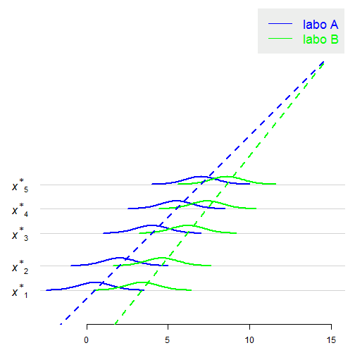
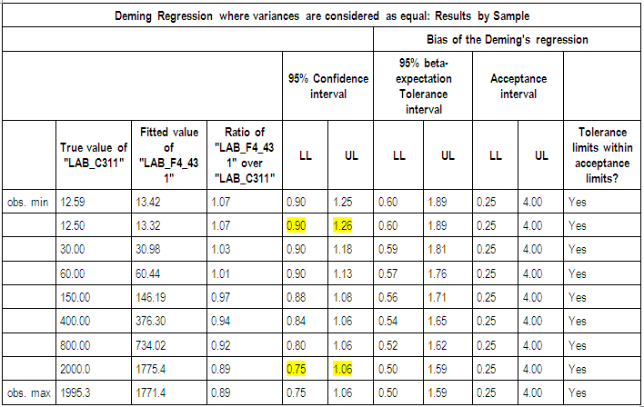

## Background  
  
- **Context**: method comparison 

- **Data**: sample of paired data $(x_i,y_i)$ (e.g. $x_i$ and $y_i$ measurements in Labo $A$ and Labo $B$)

- **Particularity**: Equivalence on a practical range of magnitude 

- **Two ways of testing equivalence**: TOST or Deming regression ?


<div class="title_box" id="bill_to">
    <div id="title">Why this recommendation ?</div>
    <div id="content">
        Use Deming because data are recorded over a range of magnitude
    </div>
</div>


--- &twocolcustomwidth

## Using TOST: theoretical requirements

*** =left

### Theoretical requirements

- For TOST, we assume $y_i-x_i \sim_{iid} {\cal N}(\mu,\sigma^2)$ (possibly after log-transforming)

- The common way to check this assumption is the qqplot:

 


*** =right

### Scatterplot of  $(x_i,y_i)$

- What should we expect to see on a scatterplot of $x$ vs $y$ ? 

 


- What is the blue line ? The red line ? 

--- &twocolcustomwidth

## Practical requirements - and another look at the model 

*** =left

- Measurements $(x_i,y_i)$ must be sampled over a practical range of magnitude: 

  - each $x_i$ is randomy distributed around its own mean value $x^*_i$

  - each $y_i$ is randomy distributed around its own mean value $y^*_i$

- Model: 

$$\large \begin{cases}
x_i = x^*_i + \epsilon_i \\
y_i = y^*_i + \epsilon'_i \\
\boxed{y^*_i = x^*_i + a} 
\end{cases}
$$
where the error terms $\epsilon_i,\epsilon'_i$ have constant variance


*** =right

 


<span style="border-style:solid;border-width:3px;border-color:seaShell;background-color:#FCDFFF;font-size:25px">*What this model is known as ?*</span>


--- #thisslide &twocolcustomwidth


## Equivalence with AV2 without interaction 


*** =left width:44%

```r
head(dat)
```

```
##   sample     A     B
## 1      1 1.753 2.318
## 2      2 4.014 3.473
## 3      3 2.645 3.636
## 4      4 6.028 5.137
## 5      5 2.783 5.657
## 6      6 6.758 8.555
```

```r
library(reshape2)
mdat <- melt(dat, id.vars = c("sample"), 
    variable.name = "labo")
head(mdat)
```

```
##   sample labo value
## 1      1    A 1.753
## 2      2    A 4.014
## 3      3    A 2.645
## 4      4    A 6.028
## 5      5    A 2.783
## 6      6    A 6.758
```


*** =right width:52%


```r
t.test(x = dat$A, y = dat$B, paired = TRUE)$conf
```

```
## [1] -1.0988  0.4205
## attr(,"conf.level")
## [1] 0.95
```

```r
confint(lm(value ~ labo + sample, data = mdat))
```

```
##                2.5 % 97.5 %
## (Intercept) -0.07089  3.803
## laboB       -0.42053  1.099
## sample2     -0.97756  4.394
## sample3     -1.58090  3.791
## sample4      0.86136  6.233
## sample5     -0.50135  4.870
## sample6      2.93528  8.307
## sample7      2.10475  7.477
## sample8      4.29289  9.665
## sample9      3.67019  9.042
## sample10     5.87207 11.244
## sample11     7.88520 13.257
## sample12     6.90808 12.280
## sample13     8.16880 13.541
## sample14     8.60851 13.980
## sample15    11.37618 16.748
## sample16    11.50347 16.875
## sample17    12.26337 17.635
## sample18    12.90898 18.281
## sample19    14.51016 19.882
## sample20    15.42939 20.801
## sample21    14.77514 20.147
## sample22    15.83199 21.204
## sample23    18.15873 23.531
## sample24    18.54447 23.916
## sample25    19.48129 24.853
```


<style>#thisslide
code {
font-size: 80%;
}
</style>


--- 

## TOST requirement as a $H_0$ hypothesis 

- Statistical checking of a distributional hypothesis is done by hypothesis testing:

- $$H_0 \colon \large \begin{cases}
x_i = x^*_i + \epsilon_i \\
y_i = y^*_i + \epsilon'_i \\
\boxed{y^*_i = x^*_i + a}
\end{cases}$$ 

- $$H_1 \colon \large \begin{cases}
x_i = x^*_i + \epsilon_i \\
y_i = y^*_i + \epsilon'_i \\
\boxed{y^*_i = f(x^*_i)} 
\end{cases}$$ 

- Taking $\large\boxed{f(x^*_i) = a + bx^*_i}$ then $H_1$ is the Deming regression model 

- Model $H_0$ is a particular case of Deming regression with $b=1$ 


--- &twocolcustomwidth

## Deming as a generalization of AV2 without interaction

*** =left

 


*** =right 

 


*** =fullwidth


--- 

## Testing equivalence with Deming: 1) what ? 

Equivalence should be assessed at the **boundary** of the range:

 


--- 

## Testing equivalence with Deming: 2) how ? 

- Everything is already done in our SAS application:




--- #slidepower &twocolcustomwidth


## Comparing TOST and Deming 

If TOST requirements hold true and if we use Deming regression then we dramatically loose power  

<u>**Example with $\Delta=2$ :**</u>

*** =left 

$\sigma^2_x + \sigma^2_y = 4$ 


```
## $test.xmin
##     lambda=0.25 lambda=0.5 lambda=1 lambda=2 lambda=5
## a=1        42.7       42.0     43.6     43.1     44.3
## a=2         2.0        2.1      2.1      2.3      2.6
## a=3         0.0        0.0      0.0      0.0      0.0
## 
## $test.xmax
##     lambda=0.25 lambda=0.5 lambda=1 lambda=2 lambda=5
## a=1        43.8       45.2     44.2     44.3     43.5
## a=2         3.3        3.2      3.1      3.0      2.9
## a=3         0.0        0.0      0.0      0.0      0.0
## 
## $tost
##     lambda=0.25 lambda=0.5 lambda=1 lambda=2 lambda=5
## a=1        93.5       93.3     93.4     93.1     93.5
## a=2         2.8        2.2      2.4      2.5      2.5
## a=3         0.0        0.0      0.0      0.0      0.0
```


*** =right

$\sigma^2_x + \sigma^2_y = 8$ 


```
## $test.xmin
##     lambda=0.25 lambda=0.5 lambda=1 lambda=2 lambda=5
## a=1        15.4       16.1     18.5     18.8     20.8
## a=2         1.2        1.3      1.4      1.9      2.3
## a=3         0.0        0.0      0.0      0.1      0.0
## 
## $test.xmax
##     lambda=0.25 lambda=0.5 lambda=1 lambda=2 lambda=5
## a=1        25.7       26.4     24.5     23.2     22.5
## a=2         3.5        3.5      3.3      3.0      3.0
## a=3         0.1        0.0      0.1      0.1      0.0
## 
## $tost
##     lambda=0.25 lambda=0.5 lambda=1 lambda=2 lambda=5
## a=1        68.6       69.5     68.9     68.7     68.8
## a=2         2.8        2.2      2.4      2.5      2.5
## a=3         0.0        0.0      0.0      0.0      0.0
```


*** =fullwidth 

*Other advantage of TOST*: no need to specify the ratio of the variances $\lambda$ ! 

<style>#slidepower
code {
font-size: 62%;
font-family: "Source Code Pro", monospace;
color: 
darkRed;
background-color: 
seaShell;
}
</style>

--- 

## Conclusions 

- Bridging of methods should be considered as equivalence between the means: bridging of Labo A vs Labo A should always be accepted as long as there is a sufficient amount of data

- Currently the methodology of the SAS application is based on prediction intervals; it does not guarantee a succesful bridging of Labo A vs Labo A 

- Generally the estimated slope is near from $1$; we could use TOST instead of Deming, and gain a considerable power

- Work: define a rule to decide when to use TOST instead of Deming
